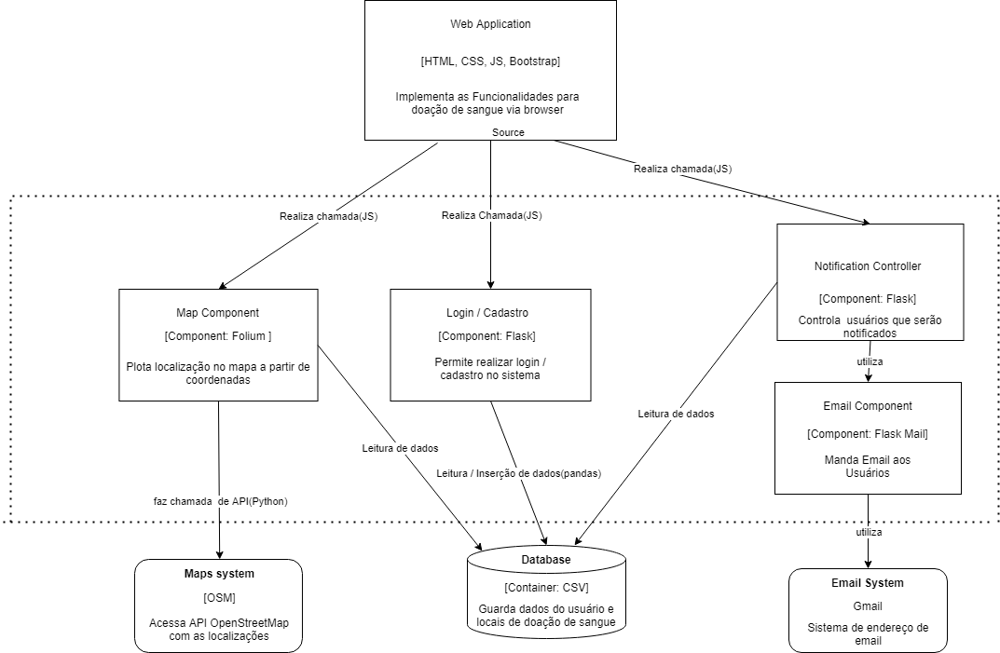

# Projeto de Engenharia de Software - MC426

## Descrição:
Aplicação para doação de sangue com mapeamento dos locais de doação, tendo como objetivo facilitar o acesso do usuário ao agendamento e lugares que melhor o acomoda.

## Breve apresentação da aplicação funcionando: 

## Diagrama em nível de componentes (C4 - Nível 3)

## Padrões de Projetos a serem Utilizados
- Login/Cadastro: Utilização do padrão Facade, inserindo numa classe principal as funções a serem utilizadas pelo cliente. (Link da issue: [#21](https://gitlab.ic.unicamp.br/ra256589/mc426/-/issues/21))
- Notification Controller: Utilização do padrão Observer, aliado ao componente de email, será realizado a notificação de um determinado grupo de usuários com o sangue desejado. (Link da issue: [#22](https://gitlab.ic.unicamp.br/ra256589/mc426/-/issues/22))
- Map Component: Utilização do padrão Singleton, inserindo as funções de mapa a serem utilizadas pelo objeto usuário da aplicação. (Link da issue: [#20](https://gitlab.ic.unicamp.br/ra256589/mc426/-/issues/20))

## Estilo Arquitetural
- Decidimos adotar o estilo de camadas para o projeto, uma vez que ele nos permitiria testar algumas features do projeto sem afetar outras camadas. Além disso, concordamos que esse estilo seria interessante por dividir um problema complexo em outros menores, que permitiriam uma manutenção mais simples das features caso precisemos modificar algo. No nosso projeto, utilizamos três camadas. A primeira delas é a presentation layer, que tem a função de apresentar a interface do software para o usuário. A segunda corresponde à logic layer, onde temos as principais aplicações que serão requisitadas durante o uso, como os controladores de login, do mapa e das notificações. Já na última camada temos a database layer, onde são guardadas as informações correspondentes aos hemocentros, aos usuários e ao sistema de mapas. 

## Descrição dos componentes
- Map: O componente Map permite a visualização do mapa de Campinas, utilizando um database e a API do OpenStreetMaps para apresentar os hemocentros disponíveis no mapa, além de permitir o plot das rotas para tais hemocentros.
- Login/Cadastro: Esse componente permite que um usuário crie seu cadastro, para que o sistema use suas informações para futuros agendamentos e notificações sobre o processo de doação de sangue.
- Notification Controller: Esse componente gerencia os estoques de sangue dos hemocentros para que, no caso de uma possível falta ou baixo estoque de certo tipo sanguíneo, usuários com esse tipo sanguíneo sejam notificados para suprir essa necessidade.
- Email Component: Esse componente permite que o Notification Controller envie notificações aos usuários por meio de um serviço de e-mail.

